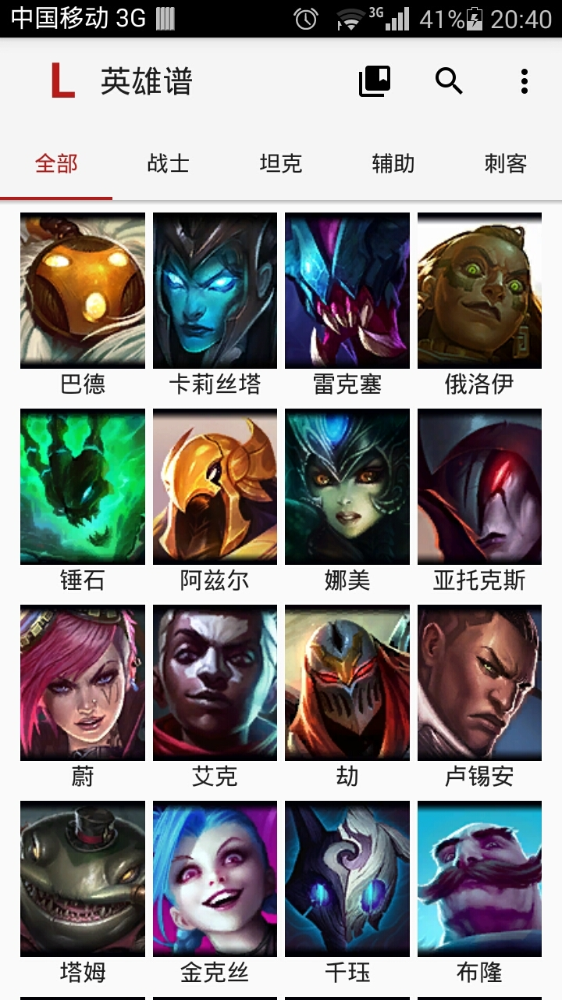
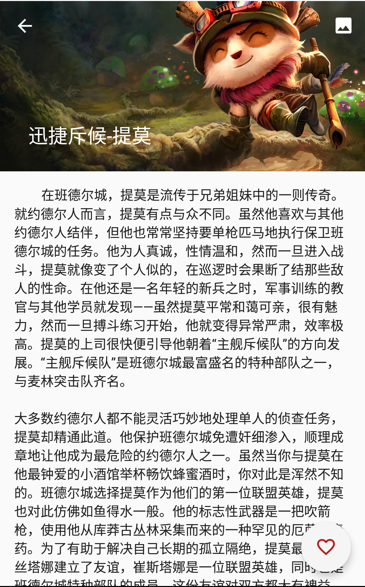

###英雄谱(Theogony)
----------------------

####介绍

英雄谱是一款关于[英雄联盟](http://na.leagueoflegends.com/)中英雄百科的App。主要由以下功能： 

* 浏览英雄背景故事
* 浏览英雄所有的插画
* 支持插画下载
* 设置插画为桌面壁纸

[APK下载](apk/theogony.apk)

####应用截图
|                             |                           |                     |                         |
|:---------------------------:|:-------------------------:|:-------------------:|:-----------------------:|
|  |  |  |  |

####关于APP_KEY
APP_KEY是由拳头公司提供，属于非公开的。所以为了保证应用的正常使用，使用者需移步[拳头开发者中心](https://developer.riotgames.com/)拿到测试APP_KEY，加到Constants RIOT_APP_KEY中。

####感谢

[CursorRecyclerViewAdapter](https://gist.github.com/skyfishjy/443b7448f59be978bc59) -skyfishjy  
[PhotoView](https://github.com/chrisbanes/PhotoView) -chrisbanes  
[Android-Universal-Image-Loader](https://github.com/nostra13/Android-Universal-Image-Loader) -nostra13  

####License

```
The MIT License (MIT)

Copyright (c) 2015 Vernon Lee

Permission is hereby granted, free of charge, to any person obtaining a copy
of this software and associated documentation files (the "Software"), to deal
in the Software without restriction, including without limitation the rights
to use, copy, modify, merge, publish, distribute, sublicense, and/or sell
copies of the Software, and to permit persons to whom the Software is
furnished to do so, subject to the following conditions:

The above copyright notice and this permission notice shall be included in all
copies or substantial portions of the Software.

THE SOFTWARE IS PROVIDED "AS IS", WITHOUT WARRANTY OF ANY KIND, EXPRESS OR
IMPLIED, INCLUDING BUT NOT LIMITED TO THE WARRANTIES OF MERCHANTABILITY,
FITNESS FOR A PARTICULAR PURPOSE AND NONINFRINGEMENT. IN NO EVENT SHALL THE
AUTHORS OR COPYRIGHT HOLDERS BE LIABLE FOR ANY CLAIM, DAMAGES OR OTHER
LIABILITY, WHETHER IN AN ACTION OF CONTRACT, TORT OR OTHERWISE, ARISING FROM,
OUT OF OR IN CONNECTION WITH THE SOFTWARE OR THE USE OR OTHER DEALINGS IN THE
SOFTWARE.
```